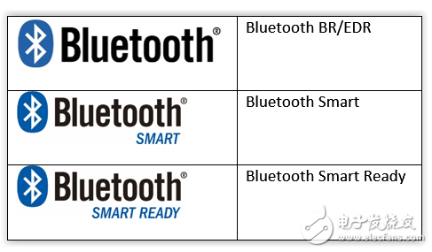
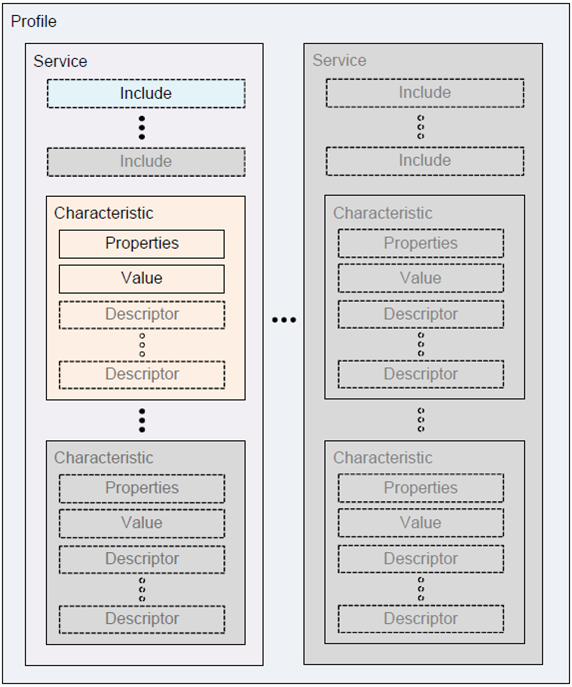

## 蓝牙大致介绍
蓝牙分为三种：**Bluetooth Smart Ready**、**Bluetooth Smart**（Smart是低功耗蓝牙的标识）、以及**标准 Bluetooth**。根据 Bluetooth SIG的说法，这样是为了要分辨装置间的相容性以及标识各版本的传输频率。基本上来说，Bluetooth Smart Ready适用于任何双模蓝牙4.0的电子产品,而Bluetooth Smart是应用在心率监视器或计步器等使用扭扣式电池并传输单一的装置。Bluetooth Smart Ready的相容性最高，可与Bluetooth Smart及标准蓝牙相通。标准蓝牙则无法与Bluetooth Smart相通。


BLE是Bluetooth Low Energy的缩写，又叫蓝牙4.0，区别于蓝牙3.0和之前的技术。BLE前身是NOKIA开发的Wibree技术，主要用于实现移动智能终端与周边配件之间的持续连接，是功耗极低的短距离无线通信技术，并且有效传输距离被提升到了100米以上，同时只需要一颗纽扣电池就可以工作数年之久。BLE是在蓝牙技术的基础上发展起来的，既同于蓝牙，又区别于传统蓝牙。BLE设备分单模和双模两种，双模简称BR，商标为Bluetooth Smart Ready，单模简称BLE或者LE,商标为Bluetooth Smart。Android是在4.3后才支持BLE，这说明不是所有蓝牙手机都支持BLE，而且支持BLE的蓝牙手机一般是双模的。双模兼容传统蓝牙，可以和传统蓝牙通信，也可以和BLE通信，常用在手机上，android4.3和IOS4.0之后版本都支持BR，也就是双模设备。单模只能和BR和单模的设备通信，不能和传统蓝牙通信，由于功耗低，待机长，所以常用在手环的智能设备上。

## 先说手机和手机之间通信
> 0、权限

6.0之前需要如下权限
```xml
    <uses-permission android:name="android.permission.BLUETOOTH" />
    <uses-permission android:name="android.permission.BLUETOOTH_ADMIN" />
```
6.0之后除了以上权限之外还需要如下权限
```xml
    <uses-permission android:name="android.permission.ACCESS_COARSE_LOCATION" />
    <uses-permission android:name="android.permission.WRITE_EXTERNAL_STORAGE" />
```
因为6.0之上的系统增加了动态权限机制，所以除了在manifest中配置权限之外还要在代码中再次动态请求一下
```java
    private void requestLocationPermission() {
        if (Build.VERSION.SDK_INT >= 23) {
            int checkResult = checkSelfPermission(Manifest.permission.ACCESS_COARSE_LOCATION);
            if (checkResult != PackageManager.PERMISSION_GRANTED) {
                requestPermissions(new String[]{Manifest.permission.ACCESS_COARSE_LOCATION}, REQUEST_LOCATION_PERMISSION_TOKEN);
            } else {
                Log.d("soar_", "已经有定位权限");
                addTextLog("已经有定位权限");
            }
        } else {
            Log.d("soar_", "6.0之下不需要请求定位权限");
            addTextLog("6.0之下不需要请求定位权限");
        }
    }
```
并实现onRequestPermissionsResult方法
```java
    @Override
    public void onRequestPermissionsResult(int requestCode, @NonNull String[] permissions, @NonNull int[] grantResults) {
        if (requestCode == REQUEST_LOCATION_PERMISSION_TOKEN) {
            if (grantResults.length > 0 && grantResults[0] == PackageManager.PERMISSION_GRANTED) {
                Log.d("soar_", "获取定位权限成功");
                addTextLog("获取定位权限成功");
            } else {
                Log.d("soar_", "获取定位权限失败");
                addTextLog("获取定位权限失败");
            }
            return;
        } 
        super.onRequestPermissionsResult(requestCode, permissions, grantResults);
    }
```
在onCreate或者其他合适的地方调用requestLocationPermission 方法去请求定位权限

6.0以上系统在使用蓝牙之前还需要动态请求蓝牙权限*
```java
    private void requestBluetoothPermission() {
        if (Build.VERSION.SDK_INT >= 23) {
            int checkResult = checkSelfPermission(Manifest.permission.BLUETOOTH);
            if (checkResult != PackageManager.PERMISSION_GRANTED) {
                requestPermissions(new String[]{Manifest.permission.BLUETOOTH}, REQUEST_BLUETOOTH_PERMISSION_TOKEN);
            } else {
                Log.d("soar_", "已经有蓝牙权限");
                addTextLog("已经有蓝牙权限");
            }
        } else {
            Log.d("soar_", "6.0之下不需要请求蓝牙权限");
            addTextLog("6.0之下不需要请求蓝牙权限");
        }
    }
```
在onRequestPermissionsResult中增加判断代码
```java
    @Override
    public void onRequestPermissionsResult(int requestCode, @NonNull String[] permissions, @NonNull int[] grantResults) {
        if (requestCode == REQUEST_BLUETOOTH_PERMISSION_TOKEN) {
            if (grantResults.length > 0 && grantResults[0] == PackageManager.PERMISSION_GRANTED) {
                Log.d("soar_", "获取蓝牙权限成功");
                addTextLog("获取蓝牙权限成功");
            } else {
                Log.d("soar_", "获取蓝牙权限失败");
                addTextLog("获取蓝牙权限失败");
            }
            return;
        }
        super.onRequestPermissionsResult(requestCode, permissions, grantResults);
    }
```
在打开蓝牙之前调用requestBluetoothPermission方法

>1、打开关闭蓝牙

首先拿到adapter对象
```java
bluetoothAdapter = BluetoothAdapter.getDefaultAdapter();//若该对象为空则代表该设备不支持蓝牙
```
然后自定义一个broadcaseReceiver接收器
```java
public class BluetoothReceiver extends BroadcastReceiver {
    @Override
    public void onReceive(Context context, Intent intent) {
    }
}
```
因为标准蓝牙设备的开关、连接断开以及扫描等动作都是可以通过通知获取到的，所以这里初始化一个接收器对象并且注册
```java
receiver = new BluetoothReceiver();
filter = new IntentFilter();//过滤器
filter.addAction(BluetoothAdapter.ACTION_DISCOVERY_STARTED);//开始扫描事件
filter.addAction(BluetoothAdapter.ACTION_DISCOVERY_FINISHED);//扫描结束事件
filter.addAction(BluetoothAdapter.ACTION_STATE_CHANGED);//状态改变事件
filter.addAction(BluetoothDevice.ACTION_FOUND);//发现一个蓝牙设备事件
filter.addAction(BluetoothDevice.ACTION_BOND_STATE_CHANGED);//连接状态改变事件
registerReceiver(receiver, filter);//注册接收器
```
记得在onDestroy方法中取消注册
```java
@Override
protected void onDestroy() {
    super.onDestroy();
    unregisterReceiver(receiver);
}
```
打开蓝牙有两种方式，第一种直接调用enable方法（android原生系统没问题，像小米等rom系统可能在原生系统基础上增加了自己的应用权限管理，则应该注意是否赋予权限，例如在android版本低于6.0小米上如果直接调用enable，如果该应用的蓝牙权限是允许则没有提示直接打开，如果蓝牙权限是提示则会弹出提示框要求用户允许或者拒绝，如果蓝牙权限是拒绝则enable没有效果，打开蓝牙失败，其他系统类似）
```java
if (bluetoothAdapter == null) {
    return;
}
if (bluetoothAdapter.isEnabled()) {
    return;
}
bluetoothAdapter.enable();
```
第二种是调用系统打开蓝牙的intent（推荐）
```java
     // 请求打开 Bluetooth
     Intent requestBluetoothOn = new Intent(BluetoothAdapter.ACTION_REQUEST_ENABLE);
     // 设置 Bluetooth 设备可以被其它 Bluetooth 设备扫描到
     requestBluetoothOn.setAction(BluetoothAdapter.ACTION_REQUEST_DISCOVERABLE);
     // 设置 Bluetooth 设备可见时间（最长300秒）
     requestBluetoothOn.putExtra(BluetoothAdapter.EXTRA_DISCOVERABLE_DURATION,300);
     // 请求开启 Bluetooth
     startActivityForResult(requestBluetoothOn,REQUEST_CODE_BLUETOOTH_ON);
```
同时需要实现onActivityResult方法
```java
@Override
protected void onActivityResult(int requestCode, int resultCode, Intent data)
{
    // requestCode 与请求开启 Bluetooth 传入的 requestCode 相对应
    if (requestCode == REQUEST_CODE_BLUETOOTH_ON)
    {
        switch (resultCode)
        {
        // 用户点击确认按钮
            case Activity.RESULT_OK:
            {
                // TODO 用户选择开启 Bluetooth，Bluetooth 会被开启
            }
            break;
            // 用户点击取消按钮或点击返回键
            case Activity.RESULT_CANCELED:
            {
                // TODO 用户拒绝打开 Bluetooth, Bluetooth 不会被开启
            }
            break;
            default:
            break;
        }
    }
}
```
其实还有第三种，跳到设置让用户手动打开，不过不用考虑了。

关闭更简单，disable或者调用intent
```java
bluetoothAdapter.disable();
```
>2、扫描其他蓝牙设备

确定蓝牙设备可用并且已经打开之后就可以开始扫描设备了
```java
        if (bluetoothAdapter == null) {
            return;
        }
        if (!bluetoothAdapter.isEnabled()) {
            return;
        }
        if (bluetoothAdapter.isDiscovering()) {
            return;
        }
        bluetoothAdapter.startDiscovery()
```
执行该方法之后如果扫描到设备活在receiver中接收到通知
```java
@Override
    public void onReceive(Context context, Intent intent) {
        String action = intent.getAction();
        BluetoothDevice device = intent.getParcelableExtra(BluetoothDevice.EXTRA_DEVICE);
        if (BluetoothDevice.ACTION_FOUND.equals(action)) { //发现设备
            Log.d("soar_", "发现设备" + device.getName() + ":" + device.getAddress() + ":" + BluetoothTypeUtils.getType(device.getType()));

            //device.getBondState() == BluetoothDevice.BOND_BONDED ? "已连接" : "未连接"; //判断是否已连接
            
        } else if (BluetoothAdapter.ACTION_DISCOVERY_STARTED.equals(action)) { //开始扫描设备
            Log.d("soar_", "开始发现设备");
        } else if (BluetoothAdapter.ACTION_DISCOVERY_FINISHED.equals(action)) { //停止扫描设备
            Log.d("soar_", "停止发现设备");
        } else if (BluetoothDevice.ACTION_BOND_STATE_CHANGED.equals(action)) { //连接状态发生改变
            int state = intent.getIntExtra(BluetoothDevice.EXTRA_BOND_STATE, -1);
            Log.d("soar_", "RECEIVER>>>bond state changed = " + state);
        } else if (BluetoothAdapter.ACTION_STATE_CHANGED.equals(action)) { //蓝牙状态发生改变（开关状态）
            int state = intent.getIntExtra(BluetoothAdapter.EXTRA_STATE, -1);
            int oldState = intent.getIntExtra(BluetoothAdapter.EXTRA_PREVIOUS_STATE, -1);
            Log.d("soar_", "RECEIVER>>>state changed = from: " + oldState + ">>>to:" + state);
        }
    }
```

>3、连接指定设备（配对）

这里先要解释一下标准蓝牙通信的一个概念也就是服务端和客户端的概念。当两个标准蓝牙设备之间要通信时，这里假设A扫描出了多台蓝牙设备，其中就有蓝牙设备B，那么我们需要做的是让蓝牙设备B启动一个BluetoothServerSocket对象等待连接（服务端），然后A调用BluetoothDevice对象的createRfcommSocketToServiceRecord方法得到一个BluetoothSocket对象，然后调用这个socket对象的connect方法去和服务端连接。其中A创建连接用的BluetoothDevice对象指的就是扫描出来的所有的BluetoothDevice中的一个。因为服务端的监听动作和客户端的连接动作都是阻塞的，所以这些操作都需要放到独立线程中去执行。

先说服务端，我让应用启动的时候就创建一个独立线程去启动服务端监听
```java
    private class ServerThread extends Thread {
        BluetoothServerSocket serverSocket;

        public ServerThread(BluetoothAdapter adapter) {
            try {
                serverSocket = adapter.listenUsingInsecureRfcommWithServiceRecord(Values.SERVER_NAME, UUID.fromString(Values.SERVER_UUID));
            } catch (IOException e) {
                e.printStackTrace();
            }
        }
     ｝
```
（其中的ServerName相当于为该监听自定义一个名字，第二个参数UUID相当于一个密钥，当客户端和服务端的密钥一致时才可以连接成功，格式如下）
```java
    public static final String SERVER_NAME="BluetoothChat"; //自定义
    public static final String SERVER_UUID="fa90a3a5-abcd-0000-0000-000000000000";// 自定义
```
记得在线程的run方法中启动监听
```java
 @Override
        public void run() {
            super.run();
            BluetoothSocket socket = null;
            while (serverIsRunning) {
                try {
                    if (serverSocket == null){
                        continue;
                    }
                    socket = serverSocket.accept();
                    Log.d("soar_", "ServerThread>>>serversocket is accept!");
                } catch (Exception e) {
                    e.printStackTrace();
                }
            }
        }
```
其中的accept方法会一直阻塞直到一个连接请求进来才会往下执行

 再说客户端，当应用扫描到多个蓝牙设备时，就可以启动一个独立线程去用其中一个蓝牙设备的device对象建立和服务端的socket通信了，如下
```java
private class ClientThread extends Thread {
        BluetoothSocket socket;
        BluetoothDevice device;

        public ClientThread(BluetoothDevice device) {
            this.device = device;
        }
    }
```
记得在线程的run方法中启动连接
```java
@Override
        public void run() {
            super.run();
            try {
                socket = device.createRfcommSocketToServiceRecord(UUID.fromString(Values.SERVER_UUID));
                socket.connect();
                Log.d("soar_", "ClientThread>>>socket is connect!");
            } catch (IOException e) {
                e.printStackTrace();
            }
        }
```
其中的UUID必须和服务端使用的UUID一致，否则无法创建连接。这里的connect方法也是一直阻塞的，直到连接成功。

当连接建立成功之后，服务端的accept方法和客户端的connect方法都会执行完毕，然后就可以开始传输数据了。

>4、传输数据

标准蓝牙设备是使用socket流通信的，当连接建立后，就可以从各自的socket中获取输入输出流了，为了将输入和输出独立出来防止一个socket在读的时候无法写，写的时候无法读，我给socket各自创建了两个独立线程来处理输入和输出动作，服务端如下
```java
     socket = serverSocket.accept();
     serverInThread = new ServerInThread(socket.getInputStream());
     serverInThread.start();
     serverOutThread = new ServerOutThread(socket.getOutputStream());
     serverOutThread.start();
```
客户端如下
```java
     socket = device.createRfcommSocketToServiceRecord(UUID.fromString(Values.SERVER_UUID));
     socket.connect();
     clientInThread = new ClientInThread(socket.getInputStream());
     clientInThread.start();
     clientOutThread = new ClientOutThread(socket.getOutputStream());
     clientOutThread.start();
```
服务端的ServerInThread如下
```java
public class ServerInThread extends Thread {
    private InputStream inputStream;

    public ServerInThread(InputStream inputStream) {
        this.inputStream = inputStream;
    }

    @Override
    public void run() {
        super.run();

        byte[] buffer = new byte[1024];
        int bytes;
        while (true) {
            try {
                // Read from the InputStream
                if ((bytes = inputStream.read(buffer)) > 0) {
                    byte[] buf_data = new byte[bytes];
                    for (int i = 0; i < bytes; i++) {
                        buf_data[i] = buffer[i];
                    }
                    String s = new String(buf_data);
                    //s就是从流读取到的数据
                }
            } catch (IOException e) {
                try {
                    inputStream.close();
                } catch (IOException e1) {
                    // TODO Auto-generated catch block
                    e1.printStackTrace();
                }
                break;
            }

        }
    }
}
```
服务端的ServerOutThread如下
```java
public class ServerOutThread extends Thread {
    private OutputStream outputStream;
    private Handler handler;

    public ServerOutThread(OutputStream outputStream) {
        this.outputStream = outputStream;
    }

    @Override
    public void run() {
        super.run();
        Looper.prepare();
        handler = new MyHandler();
        Looper.loop();
    }

    public Handler getHandler() {
        return handler;
    }

    private class MyHandler extends Handler {
        @Override
        public void handleMessage(Message msg) {
            super.handleMessage(msg);
            try {
                byte[] bytes = ((String) msg.obj).getBytes();
                outputStream.write(bytes);
            } catch (IOException e) {
                e.printStackTrace();
            }
        }
    }
}
```
输出流线程和输入流线程不一样的地方在于输出线程创建了一个Looper队列并实现了一个Handler用来从主线程发消息给该线程，从而在该线程下执行socket输出流的write动作

客户端的输入输出与服务端的并无二致，所以不再放上代码了，步骤是一模一样的。

当通信的一方需要给另一方发数据时，只需要调用自己的OutThread的handler发送一个消息，消息体的obj就是要发送的数据，然后该消息会被自己的OutputStream通过write方法写进socket，而此时对方的socket会自动将数据通过InputStream的read方法读出来，且读写互相不阻塞。

**最后：一定记得关闭流！！！**

## 再来说BLE（低功耗蓝牙协议设备）通信

蓝牙4.0之后的BLE协议设备的通信方式真的是和标准设备完全不一样啊，所以在填坑的过程中用了很久才搞明白ble通信的原理，这里说明一下ble设备严格意义上并不能称之为“通信 ”，而应该称之为“操作 ”，读操作、写操作、连接操作、断开操作等等。

>0，权限

其他都和上面标准蓝牙的权限一样，唯一需要注意的是在5.0之上的系统除了这些权限之外还需要在manifest中增加如下特征
```xml
    <!-- 5.0以上系统使用BLE需要添加该特征 -->
    <uses-feature android:name="android.hardware.location.gps" />
```
>1、打开蓝牙

这里介绍另一种打开蓝牙和获取BluetoothAdapter对象的方法
```java
        BluetoothManager bluetoothManager = (BluetoothManager) getSystemService(BLUETOOTH_SERVICE);
        bluetoothAdapter = bluetoothManager.getAdapter();
        if (bluetoothAdapter == null || !bluetoothAdapter.isEnabled()) { //蓝牙不支持或者未打开
            Intent intent = new Intent(BluetoothAdapter.ACTION_REQUEST_ENABLE);
            startActivityForResult(intent, INTENT_REQUEST_BT_ENABLE);
        } else { //已经打开
        }
```
另外记得判断一下手机是否支持ble设备（一般android4.3也就是api18以上都是支持的）
```java
public boolean isBLESupported() {
     boolean flag = true;
     if(!mContext.getPackageManager().hasSystemFeature(PackageManager.FEATURE_BLUETOOTH_LE)) {
          flag = false;
     }
     return flag;
}
```
>2、扫描ble设备

首先实现LeScanCallback接口和其中的方法用来接收ble设备扫描结果
```java
    private class Callback implements BluetoothAdapter.LeScanCallback {

        @Override
        public void onLeScan(BluetoothDevice device, int rssi, byte[] scanRecord) {
            Log.d("soar_", "onLeScan>>>" + device.getAddress() + ":" + device.getName());
        }
    }
```
然后调用adapter的开始le扫描方法
```java
    bluetoothAdapter.startLeScan(callback);
    Log.d("soar_", "开始扫描ble蓝牙设备...");
```
注：该方法在6.0之上已经被标注为已过期，但是为了兼容老版本手机，该方法还是可以使用的

每当扫描到ble设备后会进入callback的onLeScan方法，因为每个ble设备是会被多次扫描到的，所以扫描结果需要手动判断是否已经扫描到过

扫描ble设备会比较耗费系统资源，所以在扫描到需要的设备后请一定记得关闭扫描
```java
    bluetoothAdapter.stopLeScan(callback);
    Log.d("soar_", "停止扫描ble蓝牙设备");
```

>3、连接ble设备

扫描到需要的设备后就可以连接设备了，首先重写BluetoothGattCallback类并重写需要的方法
```java
class MyGateCallback extends BluetoothGattCallback {
        @Override
        public void onConnectionStateChange(BluetoothGatt gatt, int status, int newState) { //连接状态改变
            switch (newState) {
                case BluetoothProfile.STATE_CONNECTED: {
                    Log.d("soar_", "onConnectionStateChange>>>已连接:" + gatt.getDevice().getAddress());
                }
                break;
                case BluetoothProfile.STATE_DISCONNECTED: {
                    Log.d("soar_", "onConnectionStateChange>>>已断开:" + gatt.getDevice().getAddress());
                }
                break;
                case BluetoothProfile.STATE_CONNECTING: {
                    Log.d("soar_", "onConnectionStateChange>>>连接中...:" + gatt.getDevice().getAddress());
                }
                break;
                case BluetoothProfile.STATE_DISCONNECTING: {
                    Log.d("soar_", "onConnectionStateChange>>>断开中...:" + gatt.getDevice().getAddress());
                }
                break;
            }
            super.onConnectionStateChange(gatt, status, newState);
        }

        @Override
        public void onServicesDiscovered(BluetoothGatt gatt, int status) {
            super.onServicesDiscovered(gatt, status);
        }

        @Override
        public void onCharacteristicChanged(BluetoothGatt gatt, BluetoothGattCharacteristic characteristic) {
            super.onCharacteristicChanged(gatt, characteristic);
        }

        @Override
        public void onCharacteristicRead(BluetoothGatt gatt, BluetoothGattCharacteristic characteristic, int status) {
            super.onCharacteristicRead(gatt, characteristic, status);
        }

        @Override
        public void onCharacteristicWrite(BluetoothGatt gatt, BluetoothGattCharacteristic characteristic, int status) {
            super.onCharacteristicWrite(gatt, characteristic, status);
       }
    }
```
然后调用如下代码连接设备（第一个参数为上下文，第二个参数为是否自动连接，第三个参数为gattcallback对象）
```java
    bluetoothGatt = choiceDevice.connectGatt(this, true, gattCallback);
    Log.d("soar_", "onItemClick>>>开始连接设备获取Gatt:" + choiceDevice.getAddress());
```
当连接成功或者失败后会进入BluetoothGattCallback的onConnectionStateChange方法，在这里能获取连接结果，判断方式上面已经给出

>4、读取数据

**这里我们暂停一下，因为在继续之前需要详细介绍一下ble设备的一些概念，否则你会对接下来的操作一脸懵逼，不知所云。**

操作ble设备需要知道ble设备的数据是使用一种叫做gatt的框架来提供的，这样是为了统一各种蓝牙设备之间的通信方式。

在该框架下，ble的数据分为 Service（服务）、 Characteristic（特性）和Descriptor（描述），一个ble设备提供多种服务，一个服务有多条特性，一个特性包含一个value和零到多个对该value的描述

>uuid：唯一标识，所有的服务、特性和描述都有唯一的uuid来定义，这些uuid是由bluetooth组织定义的，所有的ble设备都遵循该uuid定义，所以要获取或者写入ble设备的某些属性，只需要参考bluetooth官方提供的uuid定义列表即可。我将在下面的附属文件中列出官方手册中对uuid的定义。

>BluetoothGatt：可以看成是ble设备从连接到断开的所有生命周期对象，通过该对象可以操作ble设备的连接断开、发现服务、获取和写入数据等

GATT配置文件的层次结构



下面继续：

获取到BluetoothGatt对象之后，我们首先调用其discoverServices方法来获取ble设备支持的所有服务
```java
     bluetoothGatt.discoverServices();
     Log.d("soar_", "开始扫描服务..." + bluetoothGatt.getDevice().getAddress());
```
扫描结果会以回调的方式进入BluetoothGattCallback的onServicesDiscovered方法
```java
@Override
        public void onServicesDiscovered(BluetoothGatt gatt, int status) {
            super.onServicesDiscovered(gatt, status);
            if (status == BluetoothGatt.GATT_SUCCESS) {
                Log.d("soar_", "onItemClick>>>发现服务成功" + ":" + gatt.getDevice().getAddress());
                List<BluetoothGattService> services = gatt.getServices();
                for (BluetoothGattService serv : services) {
                    Log.d("soar_", "services>>>" + serv.getUuid() + ":" + gatt.getDevice().getAddress());
                    List<BluetoothGattCharacteristic> chars = serv.getCharacteristics();
                    for (BluetoothGattCharacteristic cha : chars) {
                        Log.d("soar_", "chars>>>" + cha.getUuid() + ":" + gatt.getDevice().getAddress());
                    }
                }
                Log.d("soar_", "发现服务完成" + ":" + gatt.getDevice().getAddress());
            } else {
                Log.d("soar_", "onItemClick>>>发现服务失败");
            }
        }
```
扫描结果如下
```
02-24 11:09:16.099 17140-17151/com.soar.bluetoothdemo D/soar_: 开始扫描服务...88:0F:10:FB:DF:5E
02-24 11:09:16.104 17140-17151/com.soar.bluetoothdemo D/soar_: onItemClick>>>发现服务成功:88:0F:10:FB:DF:5E
02-24 11:09:16.104 17140-17151/com.soar.bluetoothdemo D/soar_: services>>>00001800-0000-1000-8000-00805f9b34fb:88:0F:10:FB:DF:5E
02-24 11:09:16.104 17140-17151/com.soar.bluetoothdemo D/soar_: chars>>>00002a00-0000-1000-8000-00805f9b34fb:88:0F:10:FB:DF:5E
02-24 11:09:16.104 17140-17151/com.soar.bluetoothdemo D/soar_: chars>>>00002a01-0000-1000-8000-00805f9b34fb:88:0F:10:FB:DF:5E
02-24 11:09:16.104 17140-17151/com.soar.bluetoothdemo D/soar_: chars>>>00002a02-0000-1000-8000-00805f9b34fb:88:0F:10:FB:DF:5E
02-24 11:09:16.104 17140-17151/com.soar.bluetoothdemo D/soar_: chars>>>00002a04-0000-1000-8000-00805f9b34fb:88:0F:10:FB:DF:5E
02-24 11:09:16.104 17140-17151/com.soar.bluetoothdemo D/soar_: services>>>00001801-0000-1000-8000-00805f9b34fb:88:0F:10:FB:DF:5E
02-24 11:09:16.104 17140-17151/com.soar.bluetoothdemo D/soar_: chars>>>00002a05-0000-1000-8000-00805f9b34fb:88:0F:10:FB:DF:5E
02-24 11:09:16.104 17140-17151/com.soar.bluetoothdemo D/soar_: services>>>0000fee0-0000-1000-8000-00805f9b34fb:88:0F:10:FB:DF:5E
02-24 11:09:16.104 17140-17151/com.soar.bluetoothdemo D/soar_: chars>>>0000ff01-0000-1000-8000-00805f9b34fb:88:0F:10:FB:DF:5E
02-24 11:09:16.104 17140-17151/com.soar.bluetoothdemo D/soar_: chars>>>0000ff02-0000-1000-8000-00805f9b34fb:88:0F:10:FB:DF:5E
02-24 11:09:16.104 17140-17151/com.soar.bluetoothdemo D/soar_: chars>>>0000ff03-0000-1000-8000-00805f9b34fb:88:0F:10:FB:DF:5E
02-24 11:09:16.104 17140-17151/com.soar.bluetoothdemo D/soar_: chars>>>0000ff04-0000-1000-8000-00805f9b34fb:88:0F:10:FB:DF:5E
02-24 11:09:16.104 17140-17151/com.soar.bluetoothdemo D/soar_: chars>>>0000ff05-0000-1000-8000-00805f9b34fb:88:0F:10:FB:DF:5E
02-24 11:09:16.105 17140-17151/com.soar.bluetoothdemo D/soar_: chars>>>0000ff06-0000-1000-8000-00805f9b34fb:88:0F:10:FB:DF:5E
02-24 11:09:16.105 17140-17151/com.soar.bluetoothdemo D/soar_: chars>>>0000ff07-0000-1000-8000-00805f9b34fb:88:0F:10:FB:DF:5E
02-24 11:09:16.105 17140-17151/com.soar.bluetoothdemo D/soar_: chars>>>0000ff08-0000-1000-8000-00805f9b34fb:88:0F:10:FB:DF:5E
02-24 11:09:16.105 17140-17151/com.soar.bluetoothdemo D/soar_: chars>>>0000ff09-0000-1000-8000-00805f9b34fb:88:0F:10:FB:DF:5E
02-24 11:09:16.105 17140-17151/com.soar.bluetoothdemo D/soar_: chars>>>0000ff0a-0000-1000-8000-00805f9b34fb:88:0F:10:FB:DF:5E
02-24 11:09:16.105 17140-17151/com.soar.bluetoothdemo D/soar_: chars>>>0000ff0b-0000-1000-8000-00805f9b34fb:88:0F:10:FB:DF:5E
02-24 11:09:16.105 17140-17151/com.soar.bluetoothdemo D/soar_: chars>>>0000ff0c-0000-1000-8000-00805f9b34fb:88:0F:10:FB:DF:5E
02-24 11:09:16.105 17140-17151/com.soar.bluetoothdemo D/soar_: chars>>>0000ff0d-0000-1000-8000-00805f9b34fb:88:0F:10:FB:DF:5E
02-24 11:09:16.105 17140-17151/com.soar.bluetoothdemo D/soar_: chars>>>0000ff0e-0000-1000-8000-00805f9b34fb:88:0F:10:FB:DF:5E
02-24 11:09:16.105 17140-17151/com.soar.bluetoothdemo D/soar_: chars>>>0000ff0f-0000-1000-8000-00805f9b34fb:88:0F:10:FB:DF:5E
02-24 11:09:16.105 17140-17151/com.soar.bluetoothdemo D/soar_: chars>>>0000ff10-0000-1000-8000-00805f9b34fb:88:0F:10:FB:DF:5E
02-24 11:09:16.105 17140-17151/com.soar.bluetoothdemo D/soar_: chars>>>0000fec9-0000-1000-8000-00805f9b34fb:88:0F:10:FB:DF:5E
02-24 11:09:16.105 17140-17151/com.soar.bluetoothdemo D/soar_: services>>>0000fee1-0000-1000-8000-00805f9b34fb:88:0F:10:FB:DF:5E
02-24 11:09:16.105 17140-17151/com.soar.bluetoothdemo D/soar_: chars>>>0000fedd-0000-1000-8000-00805f9b34fb:88:0F:10:FB:DF:5E
02-24 11:09:16.105 17140-17151/com.soar.bluetoothdemo D/soar_: chars>>>0000fede-0000-1000-8000-00805f9b34fb:88:0F:10:FB:DF:5E
02-24 11:09:16.105 17140-17151/com.soar.bluetoothdemo D/soar_: chars>>>0000fedf-0000-1000-8000-00805f9b34fb:88:0F:10:FB:DF:5E
02-24 11:09:16.105 17140-17151/com.soar.bluetoothdemo D/soar_: chars>>>0000fed0-0000-1000-8000-00805f9b34fb:88:0F:10:FB:DF:5E
02-24 11:09:16.105 17140-17151/com.soar.bluetoothdemo D/soar_: chars>>>0000fed1-0000-1000-8000-00805f9b34fb:88:0F:10:FB:DF:5E
02-24 11:09:16.105 17140-17151/com.soar.bluetoothdemo D/soar_: chars>>>0000fed2-0000-1000-8000-00805f9b34fb:88:0F:10:FB:DF:5E
02-24 11:09:16.106 17140-17151/com.soar.bluetoothdemo D/soar_: chars>>>0000fed3-0000-1000-8000-00805f9b34fb:88:0F:10:FB:DF:5E
02-24 11:09:16.106 17140-17151/com.soar.bluetoothdemo D/soar_: services>>>0000fee7-0000-1000-8000-00805f9b34fb:88:0F:10:FB:DF:5E
02-24 11:09:16.106 17140-17151/com.soar.bluetoothdemo D/soar_: chars>>>0000fec7-0000-1000-8000-00805f9b34fb:88:0F:10:FB:DF:5E
02-24 11:09:16.106 17140-17151/com.soar.bluetoothdemo D/soar_: chars>>>0000fec8-0000-1000-8000-00805f9b34fb:88:0F:10:FB:DF:5E
02-24 11:09:16.106 17140-17151/com.soar.bluetoothdemo D/soar_: chars>>>0000fec9-0000-1000-8000-00805f9b34fb:88:0F:10:FB:DF:5E
02-24 11:09:16.106 17140-17151/com.soar.bluetoothdemo D/soar_: services>>>00001802-0000-1000-8000-00805f9b34fb:88:0F:10:FB:DF:5E
02-24 11:09:16.106 17140-17151/com.soar.bluetoothdemo D/soar_: chars>>>00002a06-0000-1000-8000-00805f9b34fb:88:0F:10:FB:DF:5E
02-24 11:09:16.106 17140-17151/com.soar.bluetoothdemo D/soar_: 发现服务完成:88:0F:10:FB:DF:5E
```
从ble设备读取数据分为两种方式，第一种方式是主动从设备获取，第二种方式是注册一个通知，当ble设备的某个数据发生改变时通知自己。

>先介绍第一种

首先根据获取到的UUID定义一个服务和特性对象，然后调用特性的read方法
```java
BluetoothGattService service = bluetoothGatt.getService(UUID.fromString("00001800-0000-1000-8000-00805f9b34fb"));
BluetoothGattCharacteristic characteristic =service.getCharacteristic(UUID.fromString("00002a00-0000-1000-8000-00805f9b34fb"));
bluetoothGatt.readCharacteristic(characteristic);
```
读取结果将会以回调的方式进入BluetoothGattCallback的onCharacteristicRead方法
```java
        @Override
        public void onCharacteristicRead(BluetoothGatt gatt, BluetoothGattCharacteristic characteristic, int status) {
            super.onCharacteristicRead(gatt, characteristic, status);
            byte[] array = characteristic.getValue();
            if (array==null){
                return;
            }
            Log.d("soar_", "onCharacteristicRead>>>" + new String(array));
        }
```
>再介绍第二种

同样创建一个服务和特性对象，然后注册通知
```java
BluetoothGattService service = bluetoothGatt.getService(UUID.fromString("00001800-0000-1000-8000-00805f9b34fb"));
BluetoothGattCharacteristic characteristic =service.getCharacteristic(UUID.fromString("00002a00-0000-1000-8000-00805f9b34fb"));
bluetoothGatt.setCharacteristicNotification(characteristic,true);
```
第二个参数为是否通知，true代表通知，使用该参数可以取消已经设置的通知，通知结果将会以回调的方式进入BluetoothGattCallback的onCharacteristicChanged方法
```java
        @Override
        public void onCharacteristicChanged(BluetoothGatt gatt, BluetoothGattCharacteristic characteristic) {
            super.onCharacteristicChanged(gatt, characteristic);
            byte[] array = characteristic.getValue();
            if (array==null){
                return;
            }
            Log.d("soar_", "onCharacteristicChanged>>>" + new String(array));
        }
```
>5、写入数据

写数据和读取类似，定义服务和特性对象，然后调用setvalue方法写入值，最后调用gatt对象的writeCharacteristic方法。

最后是[官方BLE手册的UUID翻译](static/file/file1.xls)