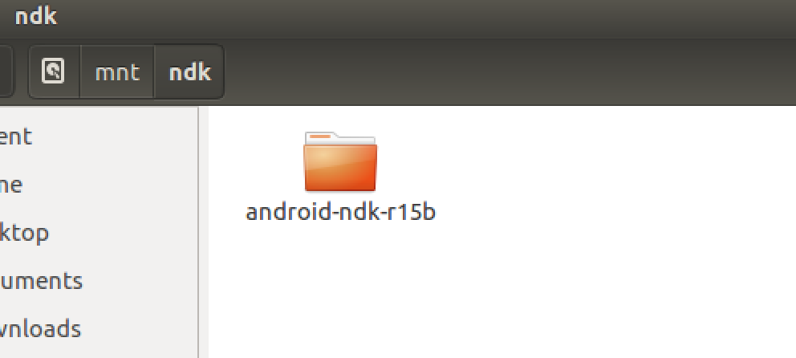
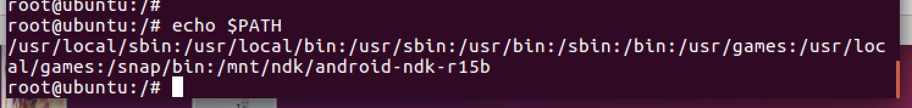
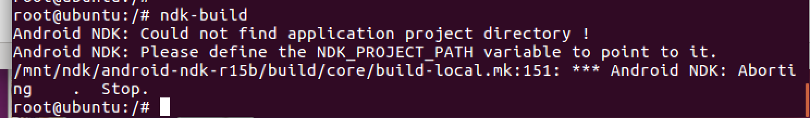
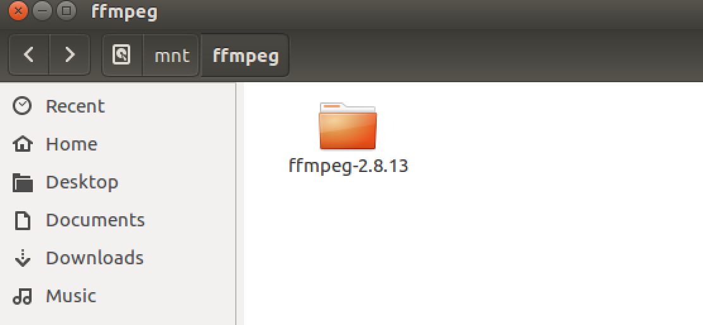
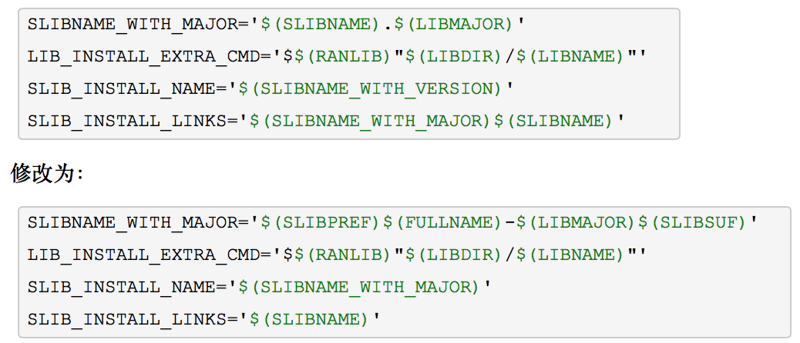
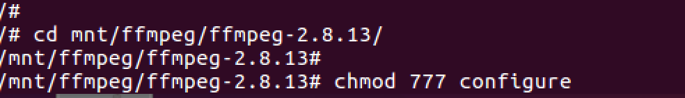
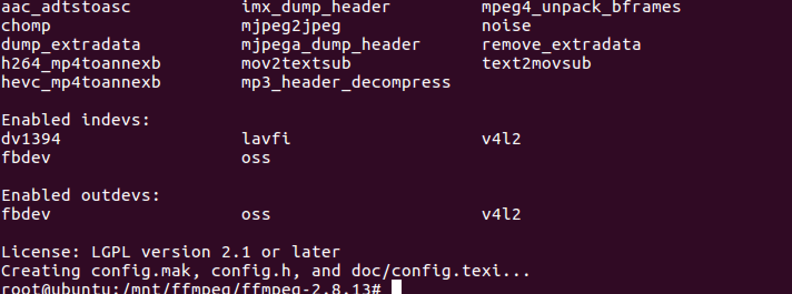
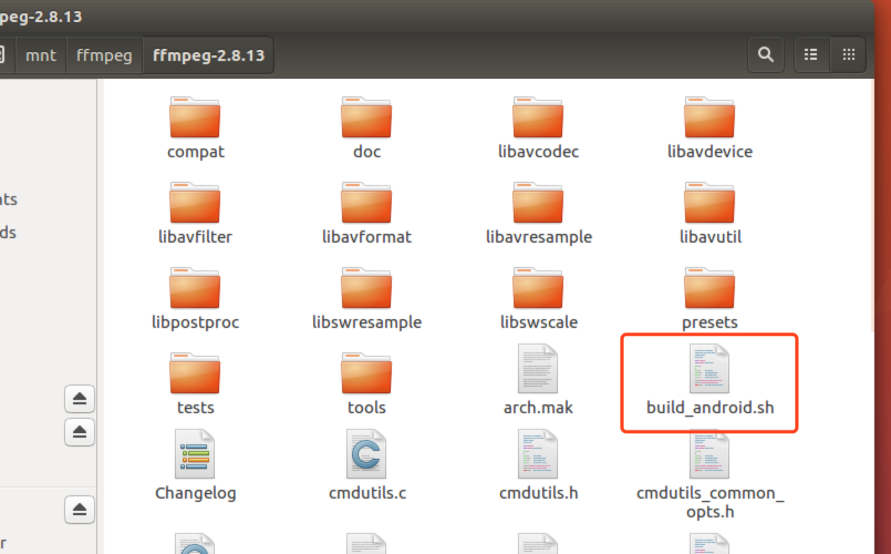

>ffmpeg编译对环境的要求太大了，有一个版本不对就有可能编译不过出各种奇奇怪怪的问题，所以请严格按照该版本，全程在root用户下进行。

参考：
>[https://www.cnblogs.com/furzoom/p/7710126.html]( https://www.cnblogs.com/furzoom/p/7710126.html)
>[http://blog.csdn.net/shuzfan/article/details/52690554](http://blog.csdn.net/shuzfan/article/details/52690554)
>[http://www.ffmpeg.org/download.html#releases](http://www.ffmpeg.org/download.html#releases)

----
* 1、安装ndk

[https://dl.google.com/android/repository/android-ndk-r15b-linux-x86_64.zip](https://dl.google.com/android/repository/android-ndk-r15b-linux-x86_64.zip)

下载ndk-r15b（用迅雷快点），解压到一个文件夹下，我放到了mnt/ndk下

用gedit打开/etc/profile文件，在文件最后增加ndk环境变量

```java
export NDK=/mnt/ndk/android-ndk-r15b
export PATH=${PATH}:$NDK
```
在终端执行以下命令使环境变量生效

```java
source /etc/profile
```
在终端输入以下命令查看全部环境变量
```java
echo $PATH
```
输出如下

在终端输入如下命令验证ndk
```java
ndk-build
```
输出如下


----
* 2、准备ffmpeg

[http://www.ffmpeg.org/releases/ffmpeg-2.8.13.tar.xz](http://www.ffmpeg.org/releases/ffmpeg-2.8.13.tar.xz)

下载ffmpeg，解压到一个文件夹下，我放在了/mnt/ffmpeg下


----

* 3、修改configure

进入ffmpeg文件夹，找到configure文件，用gedit打开，修改如下内容

将终端cd到当前目录，赋予configure文件执行权限

在终端执行该文件
```
./configure --disable-yasm
```
结果如下则正确


----

* 4、编写sh脚本

用gedit在ffmpeg目录中新建一个build_android.sh文件，文件名不是必须一致

在文件中写入如下内容
```java
#!/bin/bash
NDK=/mnt/ndk/android-ndk-r15b
SYSROOT=$NDK/platforms/android-16/arch-arm/
TOOLCHAIN=$NDK/toolchains/arm-linux-androideabi-4.9/prebuilt/linux-x86_64
PREFIX=../output
ADDI_CFLAGS="-marm”

# --disable-symver - disable symbolic versioning
function build_one
{
    ./configure \
        --prefix=$PREFIX \
        --enable-shared \
        --enable-small \
        --disable-static \
        --disable-doc \
        --disable-ffmpeg \
        --disable-ffplay \
        --disable-ffprobe \
        --disable-ffserver \
        --disable-symver \
        --target-os=linux \
        --arch=arm \
        --cross-prefix=$TOOLCHAIN/bin/arm-linux-androideabi- \
        --enable-cross-compile \
        --sysroot=$SYSROOT \
        --extra-cflags="-Os -fpic $ADDI_CFLAGS” \
        --extra-ldflags="$ADDI_LDFLAGS” \
        $ADDITIONAL_CONFIGURE_FLAG
    make clean
    make -j4
    make install
}

build_one
```
文件顶部NDK需要修改成你的NDK目录

PREFIX目录是输出目录，可以不修改

----
* 5、编译

在终端赋予build_android.sh文件可执行权限

在终端执行该文件进行编译，顺利的话喝杯茶，几到十几分钟之后，在你的输出目录下会生成include和lib目录，分别是头文件和so文件
