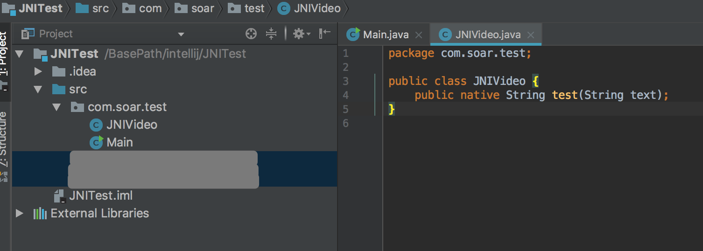
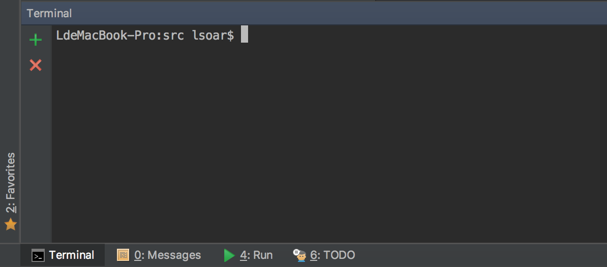
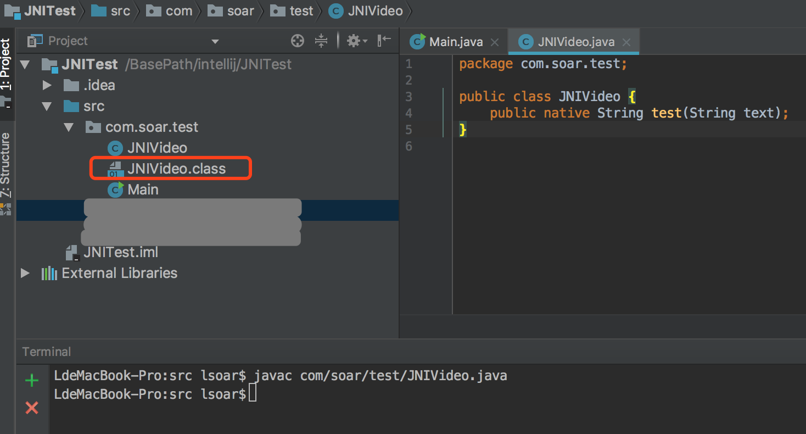
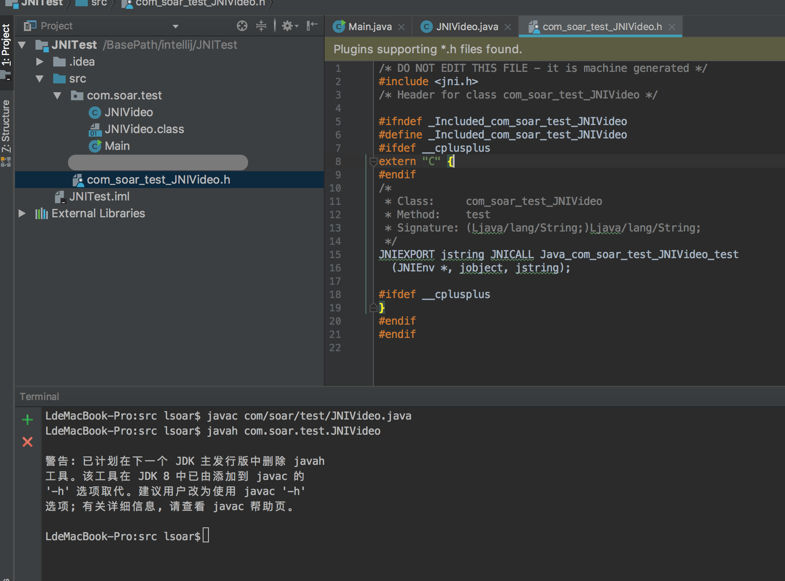
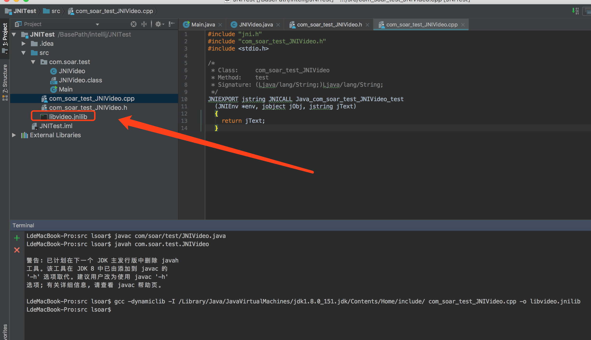
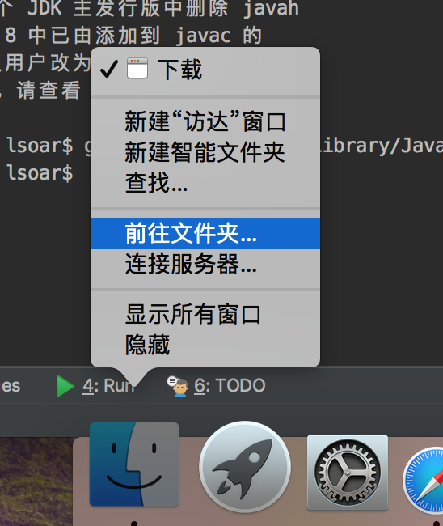
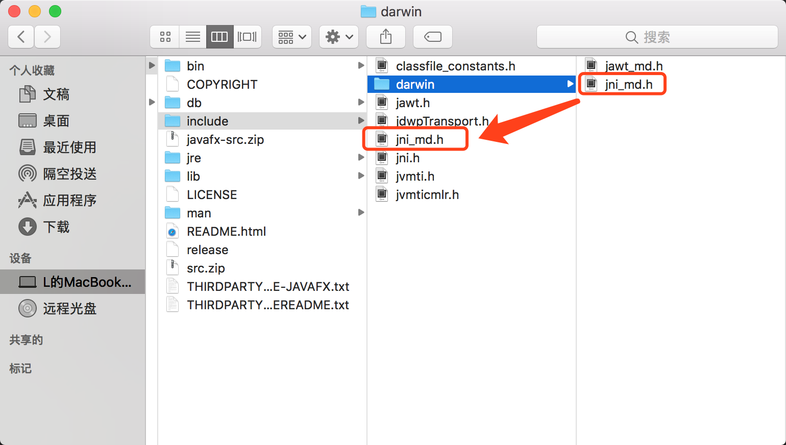

# mac OS下的JNI：helloWorld踩坑

>原本想简单的写一个macOS下的jni heloworld例子，结果没想到这里头都能有坑，好吧，记录一下，没什么难度。

>我用的macOS版本：10.13.4 (17E199)<br>
安装了jdk1.8<br>
IDE是intellij

首先新建一个java command line空工程，包结构
```java
    com.soar.test
```
目录结构如下


在包里新建一个JNIVideo类，用来放native方法
```java
package com.soar.test;

public class JNIVideo {
    public native String test(String text);
}
```

打开intellij自带的terminal，cd到工程的src内

执行如下命令生成对应的.class文件
```java
    javac com/soar/test/JNIVideo.java 
```


然后执行如下命令生成对应的.h头文件
```java
    javah com.soar.test.JNIVideo
```


在头文件的同级新建一个cpp文件，内容如下
```cpp
#include "jni.h"
#include "com_soar_test_JNIVideo.h"
#include <stdio.h>

/*
 * Class:     com_soar_test_JNIVideo
 * Method:    test
 * Signature: (Ljava/lang/String;)Ljava/lang/String;
 */
JNIEXPORT jstring JNICALL Java_com_soar_test_JNIVideo_test
  (JNIEnv *env, jobject jObj, jstring jText)
  {
    return jText;
  }
```
简单来说就是将头文件中的方法声明复制过来，给入参加上参数名并实现方法体。

这时候还是在src目录下，执行如下命令生成动态库文件
```java
gcc -dynamiclib -I /Library/Java/JavaVirtualMachines/jdk1.8.0_151.jdk/Contents/Home/include/ com_soar_test_JNIVideo.cpp -o libvideo.jnilib
```
注：

    * gcc               mac自带（也有可能是我装xcode的时候安装的，不清楚）
    * -dynamiclib       代表动态链接库
    * -I                代表include，指定头文件，注意将jdk版本换成你自己的
    * include/          后面有空格
    * xxx.cpp           代表需要编译的源文件
    * -o                代表输出文件
    * libvideo.jnilib   生成文件（mac下必须是lib开头，jnilib后缀）

正常情况下会生成产物


**但是！！！！** 

如果你执行命令出现“jni_md.h” file not found这样的报错，请继续看，否则可以跳过直接看后面的引用部分。

打开“前往文件夹”，输入如下路径

```java
/Library/Java/JavaVirtualMachines/jdk1.8.0_151.jdk/Contents/Home/include/darwin/
```
进入后复制jni_md.h文件到includ目录

再次执行命令，就能看到产出了

最后说一下怎么使用

java引用动态库由两种方式，第一种是将链接库文件放到环境变量中去，然后用System.loadLibrary方法（使用该方法时传入的是动态库名称，比如对于libvideo.jnilib文件，需要传入“video”即可），至于添加环境变量的的方式各平台不一样，可以自行百度。
另一种是使用System.load()方法，传入的是绝对路径下的文件全名。这里我使用第二种。

首先将jnilib文件复制到mac的下载目录下，然后在MainClass中添加代码
```java
package com.soar.test;

import java.io.File;

public class Main {
    static {
        File file = new File(System.getProperty("user.home")+File.separator+"Downloads"+File.separator+"libvideo.jnilib");
        System.load(file.getAbsolutePath());
    }

    public static void main(String[] args) {
        JNIVideo jniVideo = new JNIVideo();
        System.out.println(jniVideo.test("11"));
    }
}
```

成功输出，结束。