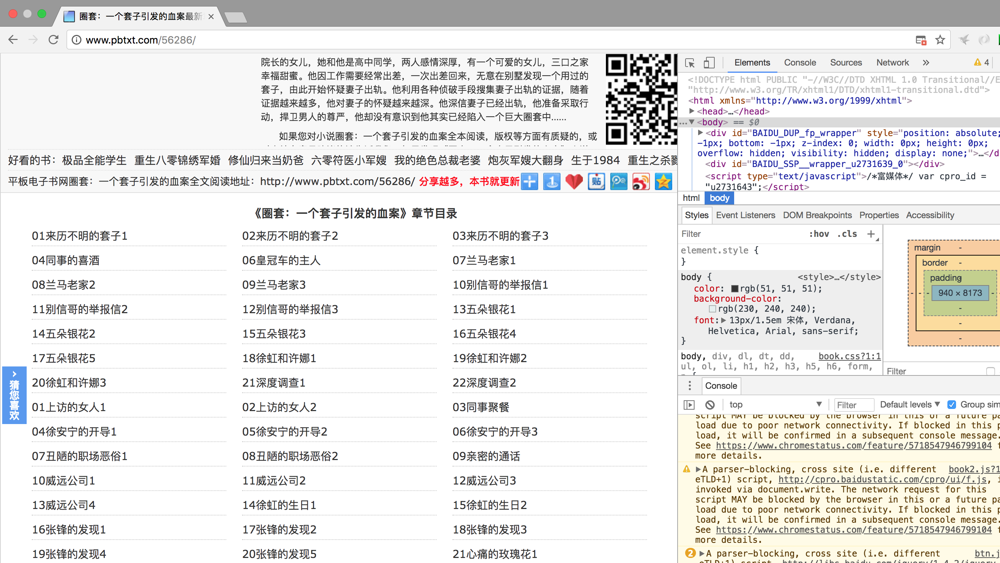
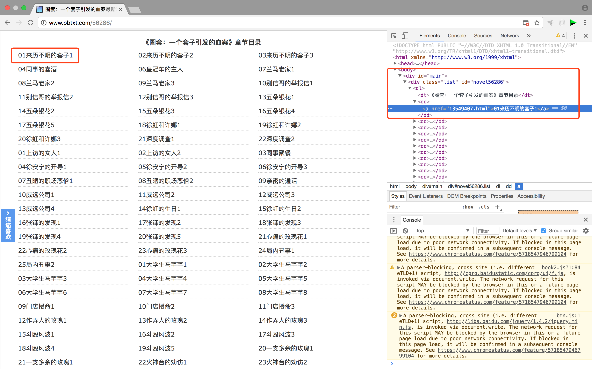
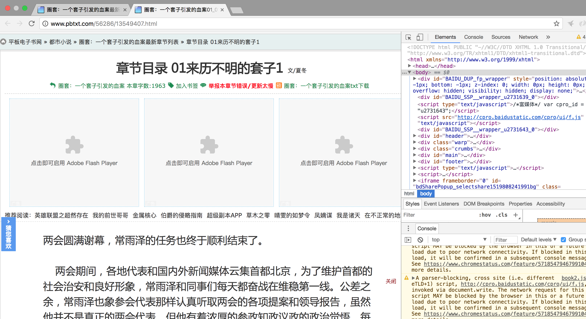
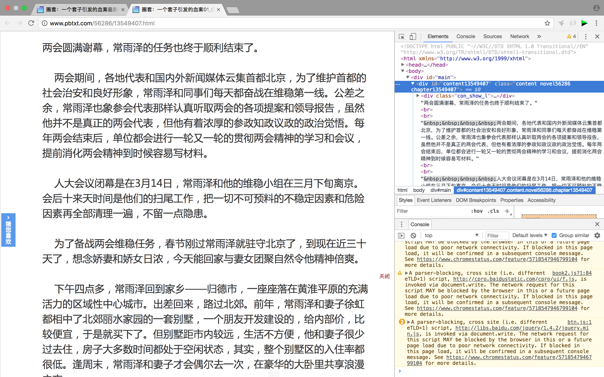

## 使用Jsoup爬取一篇网络小说

年前快放假的时候，为了消磨时间，也为了火车上有的看，就在天涯上找了几篇小说看，一开始三无部，结果有的写的实在太烂就弃了，最终剩了一部叫做《一个套子引发的血案》，连载中，就一直在追。结果年后来了一看不连载了，写着想看请到公众号blablabla，我也关注了，可是没有记住上一次阅读位置的功能，每次打开都需要从头翻，实在恶心。

遂有了这篇文章，jsoup之前就用过，这次拿来纯粹顺手，而且貌似也是java下最主流的html解析库了。支持解析文件、文本和链接，支持各种参数，支持对html文档进行各种操作和处理，非常强大。

>官方地址：[jsoup](https://jsoup.org)

>教程：[http://www.open-open.com/jsoup/](http://www.open-open.com/jsoup/)

让我们先来观察一下要爬取等网站，用chrome打开网页[http://www.pbtxt.com/56286/](http://www.pbtxt.com/56286/),并且打开开发者工具。

使用inspect工具选中其中一个章节，观察一下右侧的结构。（已经删除了无关的节点，使得看起来结构更清晰）

可以看到每个章节对应于
```
body
    div id:main
        div
            dl
                dd
                    a:href
```
其次是章节页面，同样用chrome打开一个章节链接[http://www.pbtxt.com/56286/13549407.html](http://www.pbtxt.com/56286/13549407.html)

使用inspect工具选中正文内容，观察一下右侧的结构。（已经删除了无关的节点，使得看起来结构更清晰）

可以看到正文对应于
```
body
    div id:main
        div id:content13549407
```
其中等13549407对应章节链接，需要动态写入